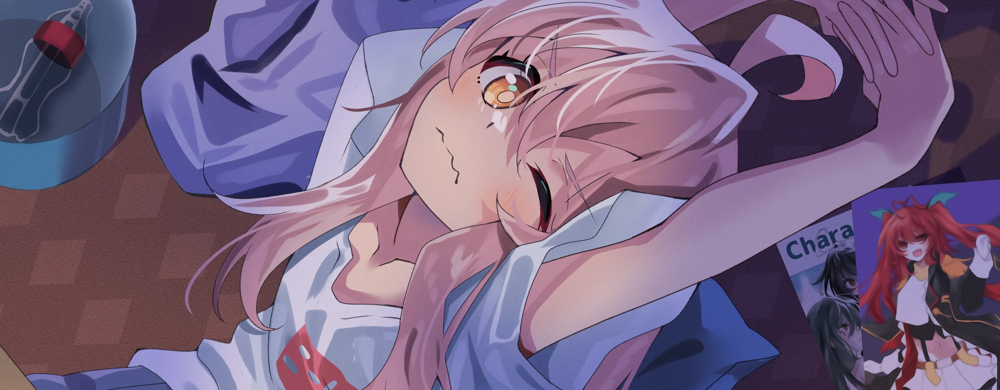

<div align="center">
</div>



### Hi! I'm Shuvi

**Weeb Developer and Gamer** 

## **☕ About me**
<a href="https://github.com/Shuvi-0"></a>
I'm Hikikomori + NEET and my hobbies are customizing stuff, playing games, reading manga, and sometimes tinkering with random stuff like coding.
<br><br><br><br>


## **💻 Experience**
<a href="https://github.com/Shuvi-0"></a>
I'm currently studying Computer science. Two years of College have passed, and I am still learning. I don't have anything special, but I hope to be able to change that in the future.


## **📊 Github Stats**
<p align="center"> 
</p>

## **🧋Cutie Counter**
<!-- <p align="center">
	 <br/>
</p> -->

<a href="https://github.com/Shuvi-0"></a>

```yaml
People who visit my profile :3.

Hehe~ another cutie has been caught.
```
<!-- <br><br><br><br> -->
## **📫 Contact**
<a href="https://github.com/Shuvi-0"></a>

**You can also email me here:** yuko.spider@gmail.com

